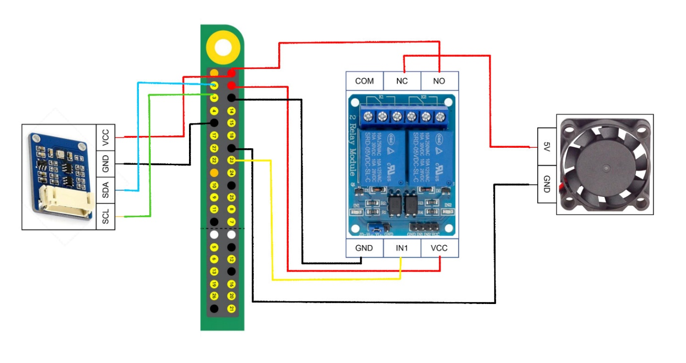

# Raspberry Pi Dokumentation

## Szenario

Wir müssen was mit der Kühlung im Serverraum machen. Seitdem wir neue Server

angeschafft haben, schalten sich die Geräte im Sommer wegen Überhitzung ab und im

Winter wachsen dort Eiszapfen von der Decke. Die Kühlung wird über einen RaspberryPi

gesteuert.

Das hat ein ehemaliger Azubi vor etwa drei Jahren entworfen und seitdem wurde nicht

mal mehr das Betriebssystem angepackt. Ich glaube, das wurde damals zeitgesteuert

programmiert. Das könnten Sie auf jeden Fall mal prüfen, das macht ja gar keinen Sinn.

Moderne Systeme reagieren ja auf die Temperatur und nicht auf die Uhrzeit.

Sie finden auf dem Server alle Unterlagen, die wir zur aktuellen Steuerung haben. Damit

könnten Sie sich erstmal einen Überblick verschaffen.

Entwickeln Sie bitte einen funktionierenden Prototypen und ganz wichtig dokumentieren

Sie alles sorgfältig. Am besten in einem Dokument mit Schaltplänen, technischen Daten,

alle Einstellungen, Programmcode und so weiter. Dann müssen wir beim nächsten Mal

nicht wieder alles zusammensuchen.

## Aufgabenverteilung im Team

[redacted]: Projekmanagement, Aushilfe

[redacted]: Netzwerkvorkonfiguration, SSH Konfiguration, Powerpoint

[redacted]: Verkabelung, Imagerestellung, Netzwerkvorkonfiguration, Powerpoint

[redacted]: Programmierung Kernprogramm, Confluence

[redacted]: Erstellung der Services, Setupskript, Confluence und Dokumentation, SSH Konfiguration

## Verwendete Tools und Programmierlösungen

### GitHub

Um den Code für alle Teammitglieder gleichermaßen Verfügbar zu machen entschieden wir uns dafür Git als Versionierungsprogramm und Github als gemeinsame Plattform zu nutzen

### Trello

Als Team war es uns wichtig jederzeit einen Überblick über den Projektfortschritt zu behalten, sowie die einzelnen Arbeitspakete „on the go“ zu ändern oder zu verwerfen.

Aus diesem Grund haben wir uns für das Projektmanagementtool Trello entschieden um unsere Arbeitspakete in einem Kanban Board zu tracken.

Unser Kanban Board können Sie [hier](https://trello.com/b/QQ5eoWSN/fancontroller-gso) finden.

### Raspberry Pi Imager

Um den Raspberry Pi mit einem Image zu bespielen nutzten wir die Open Source Software Raspberry Pi Imager, die es uns ermöglicht einfache Konfigurationen am Image vorzunehmen.

### Python

In der Embedded Programmierung verwendet man oft low level Programmiersprachen wie C oder C++. Aufgrund der geringen Komplexität, unserer Vorerfahrung im Team und der verhältnismäßig hohen Leistung des Raspberry Pis haben wir uns jedoch für Python entschieden um die dadurch frei gewordene Zeit z.B. für Projektmanagement zu nutzen.

## Setup des Raspberry Pi

Das Setup wurde mit dem Raspberry Pi Imager vorgenommen.

Mithilfe dieser Software konnten wir folgende Konfigurationen schon vor dem Aufspielen des Images vornehmen:

-   WLAN einrichten
-   SSH aktivieren
-   Hostname bestimmen

Nach dem Aufspielen des Images musste eine statische IP-Adresse eingerichtet werden. Das haben wir über eine SSH-Session realisiert.

Dazu wurde die Datei /etc/dhcpcd.conf entsprechend bearbeitet.

## Programmierung

Aufgrund von Problemen den Raspberry Pi ins WLAN zu bringen entschieden wir uns dafür die Programmierung kongruent mit dem Setup des Raspberry Pis zu starten.

Hierfür teilten wir die Gruppe auf. Amine und Luka übernahmen die Programmierung. Während [redacted] und [redacted] sich mit dem Setup des Raspberry Pis beschäftigen. Vince unterstützte beide Gruppen und übernahm das Projektmanagement.

Im Zuge der Programmierung wurden drei Dokumente produziert.

1.  **gpio.py** übernimmt die Logik des des BME280 Sensors. Der Code dafür ist auf [Github](https://github.com/Ludawi/fancontroller/blob/main/gpio.py) zu finden.
2.  **fan.service** Damit die Applikation nicht bei jedem Neustart manuell neu gestartet wird haben wir uns dafür entschieden das Programm als Service zu Linux hinzuzufügen. Dies hat den Vorteil, dass es bereits gestartet wird bevor andere Prozesse wie z.B. Skripte initialisiert werden. Die .service Datei finden Sie [hier](https://github.com/Ludawi/fancontroller/blob/main/fan.service).
3.  **Install.sh** Aufgrund der WLAN Problematik entschied sich das Team dafür, dass die Entwicklung eines Skriptes welches die nötigen Schritte der Installation automatisch ausführt sinnvoll ist. Dies ermöglichte uns eine Zeitersparung im Deployment.

## Hardware und E-Technik

Zuerst musste der I2C Support mithilfe von raspi-config aktiviert werden. Auf Amines Empfehlung installierten wir die i2c-tools mithilfe des apt Package Managers.

## Die Verkabelung

Für die Vernetzung der Komponenten orientierten wir uns am [Datenblatt](https://datasheets.raspberrypi.com/rpi4/raspberry-pi-4-datasheet.pdf) des RaspberryPi.

Die Verkabelung unserer Elektronik nahmen wir folgendermaßen vor:

# 
